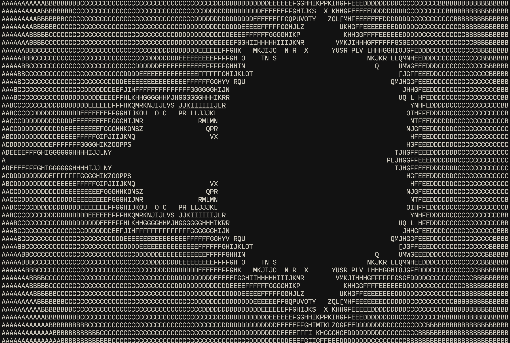

# Brainfuck 解释器

使用 rust 对 Brainfuck 的解释，并运行。

## Brainfuck

Brainfuck是Urban Müller 于 1993 年创建的一种深奥的编程语言。

该语言以其极简主义着称，仅包含八个简单的命令、一个数据指针和一个指令指针。虽然它是完全图灵完备的，但它并不是为了实际使用，而是为了挑战和娱乐程序员。Brainfuck 需要将命令分解为微观步骤。

该语言的名称参考了俚语术语brainfuck，它指的是非常复杂或不寻常的事物，以至于超出了人们的理解范围，因为它并不是为了设计实际软件而设计的，而是为了挑战计算机编程的界限。

### 打印 hello world

```brainfuck
// 打印 hello world
[ This program prints "Hello World!" and a newline to the screen, its
  length is 106 active command characters. [It is not the shortest.]

  This loop is an "initial comment loop", a simple way of adding a comment
  to a BF program such that you don't have to worry about any command
  characters. Any ".", ",", "+", "-", "<" and ">" characters are simply
  ignored, the "[" and "]" characters just have to be balanced. This
  loop and the commands it contains are ignored because the current cell
  defaults to a value of 0; the 0 value causes this loop to be skipped.
]
++++++++               Set Cell #0 to 8
[
    >++++               Add 4 to Cell #1; this will always set Cell #1 to 4
    [                   as the cell will be cleared by the loop
        >++             Add 2 to Cell #2
        >+++            Add 3 to Cell #3
        >+++            Add 3 to Cell #4
        >+              Add 1 to Cell #5
        <<<<-           Decrement the loop counter in Cell #1
    ]                   Loop until Cell #1 is zero; number of iterations is 4
    >+                  Add 1 to Cell #2
    >+                  Add 1 to Cell #3
    >-                  Subtract 1 from Cell #4
    >>+                 Add 1 to Cell #6
    [<]                 Move back to the first zero cell you find; this will
                        be Cell #1 which was cleared by the previous loop
    <-                  Decrement the loop Counter in Cell #0
]                       Loop until Cell #0 is zero; number of iterations is 8

The result of this is:
Cell no :   0   1   2   3   4   5   6
Contents:   0   0  72 104  88  32   8
Pointer :   ^

>>.                     Cell #2 has value 72 which is 'H'
>---.                   Subtract 3 from Cell #3 to get 101 which is 'e'
+++++++..+++.           Likewise for 'llo' from Cell #3
>>.                     Cell #5 is 32 for the space
<-.                     Subtract 1 from Cell #4 for 87 to give a 'W'
<.                      Cell #3 was set to 'o' from the end of 'Hello'
+++.------.--------.    Cell #3 for 'rl' and 'd'
>>+.                    Add 1 to Cell #5 gives us an exclamation point
>++.                    And finally a newline from Cell #6
```

以上代码也可写为

```brainfuck
++++++++[>++++[>++>+++>+++>+<<<<-]>+>+>->>+[<]<-]>>.>---.+++++++..+++.>>.<-.<.+++.------.--------.>>+.>++.
```

### 打印曼德尔布罗特图


